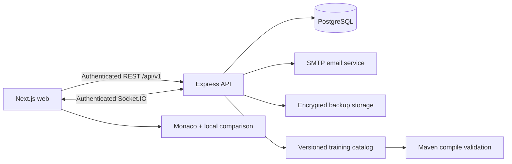

# CodeMuscle

> Release documentation update: CodeMuscle now includes registered accounts, secure server-side sessions, synchronized PostgreSQL progress, immutable multi-device draft revisions, editing leases, device management, profile/settings history, and encrypted user backups. Java language-server diagnostics are still under development and are not claimed as available in this document.

CodeMuscle is a desktop-first manual coding practice platform for experienced engineers. It presents professional reference code beside an editable IDE-style editor, compares the typed implementation in real time, provides deterministic IntelliJ-style completion, and measures whether syntax fluency is improving — without sending code to AI services.

This is **not** a LeetCode, quiz, or tutorial product. The practice loop is deliberate transcription of realistic Spring Boot code to rebuild muscle memory after heavy AI-tool reliance.

The initial catalog contains **four distinct Java 21 / Spring Boot 3.3** projects (**112** practice files). Python appears in the language selector as **Coming soon**.

## Screenshots

> Place product screenshots in `docs/screenshots/` when available:
>
> - `docs/screenshots/dashboard.png`
> - `docs/screenshots/practice.png`
> - `docs/screenshots/statistics.png`

## Architecture



The browser handles keystroke-level comparison and batches autosaves. Express owns authentication, authorization, session lifecycle, immutable draft revisions, metrics, recommendations, achievements, account history, and backups. Passwords use Argon2id. Raw opaque session tokens are sent only through `HttpOnly` cookies; PostgreSQL stores only their SHA-256 hashes.

The additive account migration preserves the existing legacy profile. When `ALLOW_FIRST_USER_LEGACY_CLAIM=true`, the first registered account can transactionally claim that profile and its existing practice progress.

## Technology stack

| Layer | Stack |
|---|---|
| Web | Next.js App Router, React, TypeScript, Monaco, TanStack Query, Zod, Recharts |
| API | Node.js, Express, Prisma, PostgreSQL, Zod, Pino, Helmet, Argon2id, Socket.IO |
| Content | On-disk Java Spring Boot projects + manifest loader |
| Tooling | pnpm workspaces, Docker Compose, Vitest, Playwright, GitHub Actions |

## Repository structure

```text
apps/web                      Next.js UI and Monaco practice workspace
apps/api                      Express API, Prisma, services, OpenAPI
packages/shared               Zod contracts and shared domain types
packages/training-content     Four Java projects under java/*/project
packages/typescript-config    Shared strict TypeScript baseline
infrastructure                API/web Dockerfiles
e2e                           Playwright journeys
implementation.md             Detailed implementation and validation history
```

## Local setup

Requirements: Node.js 24+, pnpm 10.14+, Docker Desktop.

```bash
pnpm install
docker compose up -d postgres
copy .env.example .env          # Windows
# cp .env.example .env          # macOS/Linux
pnpm --filter @codemuscle/api exec prisma generate
pnpm db:migrate
pnpm db:seed
pnpm dev
```

- Web: `http://localhost:3000`
- API health: `http://localhost:4000/api/v1/health`
- OpenAPI: `http://localhost:4000/api/v1/openapi.json`

Open `http://localhost:3000/auth/sign-up` to create the first account. Successful signup creates a server session automatically and opens onboarding.

### PhpStorm

1. `phpstorm:install` — install dependencies  
2. `phpstorm:setup` — start Postgres, migrate, seed  
3. `phpstorm:run` — start API + web together  

The root scripts are npm-compatible and bootstrap the pinned pnpm version, so PhpStorm can run them directly even when pnpm is installed at `C:\npm-global\pnpm.cmd`.

From the root `package.json`, run `phpstorm:install`, then `phpstorm:setup`, then `phpstorm:run`. Use `dev:api` and `dev:web` when separate run configurations are preferred. If Prisma generation reports an `EPERM` rename error on Windows, stop the running API configuration first; its Node process is holding Prisma's query-engine DLL.

## Docker

```bash
docker compose up -d
docker compose down
```

The current Compose file starts PostgreSQL (with health checks), API, and web. The database volume is persistent. SMTP defaults are compatible with Mailpit at `localhost:1025`, although Mailpit is not yet declared in the current Compose file.

## Environment variables

| Name | Purpose | Default |
|---|---|---|
| `DATABASE_URL` | PostgreSQL connection | local Compose database |
| `API_PORT` | Express port | `4000` |
| `WEB_ORIGIN` | CORS allowlist | `http://localhost:3000` |
| `NEXT_PUBLIC_API_URL` | Browser API base | `http://localhost:4000/api/v1` |
| `LOG_LEVEL` | Structured log level | `info` |
| `AUTH_SESSION_DAYS` | Standard session lifetime in days | `7` |
| `AUTH_REMEMBER_DAYS` | Remember-me lifetime in days | `30` |
| `AUTH_ARGON2_MEMORY_KIB` | Argon2id memory cost | `65536` |
| `AUTH_ARGON2_TIME_COST` | Argon2id time cost | `3` |
| `AUTH_ARGON2_PARALLELISM` | Argon2id parallelism | `1` |
| `AUTH_IP_SALT` | Salt used before storing IP hashes | local development value |
| `ALLOW_FIRST_USER_LEGACY_CLAIM` | Allow first account to claim legacy progress | enabled unless `false` |
| `SMTP_HOST` | Verification/reset SMTP host | `localhost` |
| `SMTP_PORT` | Verification/reset SMTP port | `1025` |
| `SMTP_FROM` | Account-email sender | local no-reply address |
| `APP_URL` | Base URL used in account email links | `http://localhost:3000` |
| `DRAFT_LEASE_MS` | Active editing lease duration | `60000` |
| `BACKUP_LOCAL_DIRECTORY` | Encrypted local backup directory | `./data/backups` |
| `BACKUP_ENCRYPTION_KEY` | Base64-encoded 32-byte AES key | required in production |

Backups cannot be decrypted if `BACKUP_ENCRYPTION_KEY` is lost or changed. Keep production keys outside source control.

## Commands

```bash
pnpm dev
pnpm build
pnpm lint
pnpm typecheck
pnpm test
pnpm test:e2e
pnpm validate:training-projects
pnpm db:migrate
pnpm db:seed
pnpm db:reset
```

`pnpm validate:training-projects` compiles each on-disk reference project with `maven:3.9.11-eclipse-temurin-21` via Docker.

## Training projects

| Project | Package | Practice files |
|---|---|---|
| Employee HR Management System | `com.codemuscle.hr` | 29 |
| Logistics and Shipment Management System | `com.codemuscle.logistics` | 27 |
| Energy Consumption and Billing System | `com.codemuscle.energy` | 28 |
| Multi-Tenant B2B SaaS Platform | `com.codemuscle.saas` | 28 |

Content lives under `packages/training-content/java/<slug>/` with `manifest.json` + `project/` sources. Regenerate with:

```bash
pnpm --filter @codemuscle/training-content generate
```

### Adding a new Java training project

1. Create `packages/training-content/java/<slug>/manifest.json` and a compilable `project/` tree.  
2. List practice `.java` paths in the manifest with difficulty, order, topics.  
3. Run `pnpm --filter @codemuscle/training-content test` and `pnpm validate:training-projects`.  
4. Reseed: `pnpm db:seed`.

### Adding another language later

Implement a `LanguageDefinition` in `@codemuscle/shared` (extensions, Monaco id, completion catalog, comparison strategy). Add content under `packages/training-content/<language>/`, enable the language row, and register a Monaco completion provider. Python is already seeded as disabled / Coming soon.

## Accounts and synchronization

All application pages except authentication, privacy, and terms require a valid server session. Protected-route redirects preserve only safe internal `returnTo` paths.

Authentication endpoints cover signup with automatic sign-in, sign-in, sign-out, session inspection, CSRF, email verification, password recovery, password changes, and session revocation. Verification does not block normal practice, but it is required for backup export and restore.

The account area provides:

- `/account` — account and practice summary
- `/account/security` — password changes and immutable security events
- `/account/devices` — concurrent browser sessions and device revocation
- `/account/history` — immutable profile/settings revisions
- `/account/backups` — encrypted backup creation, metadata, download, and restore

Browser requests include credentials and attach the readable `cm_csrf` value as `X-CSRF-Token` for unsafe operations. Never store or manually copy `cm_session`; it is an `HttpOnly` cookie.

### Draft conflict handling

Each file has a `DraftDocument` with immutable numbered `DraftRevision` records. An autosave sends its `basedOnRevision`. A stale write returns `409 DRAFT_CONFLICT` instead of overwriting newer work.

A soft editing lease prevents accidental simultaneous editing:

- Lease duration: 60 seconds by default
- The active editor refreshes the lease with heartbeats
- A second device may open read-only or explicitly take over
- Lease state is cleared during backup restore

### Backup format

Backups use versioned JSON, gzip compression, AES-256-GCM encryption, and a SHA-256 checksum. They exclude passwords, session tokens, verification/reset tokens, and raw security logs. Restore validates account ownership, checksum, authenticated encryption, schema version, verified email, and the current password. A pre-restore backup is created before transactional restoration.

## Metrics definitions

- **Correct CPM** = correct characters / active minutes  
- **Raw CPM** = all inserted characters / active minutes  
- **Lines per minute** = completed reference lines / active minutes  
- **Token accuracy** = matching tokens / compared tokens × 100  
- **Character accuracy** = matching characters / typed characters × 100  
- **Manual coding ratio** = manually typed / total inserted × 100  
- **Autocomplete dependency** = completion-inserted / total inserted × 100  
- **Error-recovery time** = average ms from mismatch to correction  

Default comparison mode is **syntax** (whitespace-tolerant token compare). **Strict** mode requires exact character match including formatting.

## Completion-provider architecture

Monaco registers a deterministic Java completion provider (no LLM):

1. Java keywords and common JDK types  
2. Spring / Lombok annotations (`@` trigger)  
3. Contextual members for `System.`, `System.out.`, `Map`, `Set`, `Stream`  
4. Symbols extracted from the current reference file  
5. Snippet-style generics (`List<T>`, `Optional<T>`, `ResponseEntity<T>`)  

Accepted completions are counted separately from manually typed characters.

## Troubleshooting

| Symptom | Fix |
|---|---|
| API not ready | Ensure Postgres is healthy: `docker compose ps` |
| Empty catalog | Run `pnpm --filter @codemuscle/training-content generate` then `pnpm db:seed` |
| Prisma client missing | `pnpm --filter @codemuscle/api exec prisma generate` |
| Maven validation fails | Docker must be running; first pull of the Maven image is large |
| Paste still works | Disable **Allow paste for accessibility** in Settings |
| Next build ENOENT on Windows | Delete `apps/web/.next` and rebuild |
| Signup rejects `deviceName` | Refresh the web app; current clients send a compact browser/platform name and the API truncates it defensively |
| Signup succeeds but email is not delivered | Start a local SMTP/Mailpit service on `SMTP_HOST:SMTP_PORT` or configure a production SMTP server |
| Backup creation is forbidden | Verify the account email first |
| Existing backup cannot decrypt | Restore the original `BACKUP_ENCRYPTION_KEY`; encrypted backups are intentionally unrecoverable without it |

## License

Private practice project — all rights reserved unless otherwise noted.
