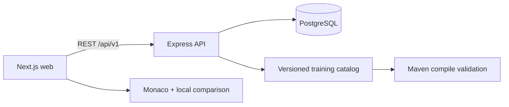

# CodeMuscle

CodeMuscle is a desktop-first manual coding practice platform for experienced engineers. It presents professional reference code beside an editable IDE-style editor, compares the typed implementation in real time, provides deterministic IntelliJ-style completion, and measures whether syntax fluency is improving — without sending code to AI services.

This is **not** a LeetCode, quiz, or tutorial product. The practice loop is deliberate transcription of realistic Spring Boot code to rebuild muscle memory after heavy AI-tool reliance.

The initial catalog contains **four distinct Java 21 / Spring Boot 3.3** projects (**77** practice files). Python appears in the language selector as **Coming soon**.

## Screenshots

> Place product screenshots in `docs/screenshots/` when available:
>
> - `docs/screenshots/dashboard.png`
> - `docs/screenshots/practice.png`
> - `docs/screenshots/statistics.png`

## Architecture



The browser handles keystroke-level comparison and batches autosaves. Express owns session lifecycle, persisted metrics, recommendations, and achievements. Prisma provides a future-auth-ready user boundary while the current release creates one local profile automatically.

## Technology stack

| Layer | Stack |
|---|---|
| Web | Next.js App Router, React, TypeScript, Monaco, TanStack Query, Zod, Recharts |
| API | Node.js, Express, Prisma, PostgreSQL, Zod, Pino, Helmet |
| Content | On-disk Java Spring Boot projects + manifest loader |
| Tooling | pnpm workspaces, Docker Compose, Vitest, Playwright, GitHub Actions |

## Repository structure

```text
apps/web                      Next.js UI and Monaco practice workspace
apps/api                      Express API, Prisma, services, OpenAPI
packages/shared               Zod contracts and shared domain types
packages/training-content     Four Java projects under java/*/project
packages/typescript-config    Shared strict TypeScript baseline
infrastructure                API/web Dockerfiles
e2e                           Playwright journeys
```

## Local setup

Requirements: Node.js 24+, pnpm 10.14+, Docker Desktop.

```bash
pnpm install
docker compose up -d postgres
copy .env.example .env          # Windows
# cp .env.example .env          # macOS/Linux
pnpm --filter @codemuscle/api exec prisma generate
pnpm db:migrate
pnpm db:seed
pnpm dev
```

- Web: `http://localhost:3000`
- API health: `http://localhost:4000/api/v1/health`
- OpenAPI: `http://localhost:4000/api/v1/openapi.json`

### PhpStorm

1. `phpstorm:install` — install dependencies  
2. `phpstorm:setup` — start Postgres, migrate, seed  
3. `phpstorm:run` — start API + web together  

## Docker

```bash
docker compose up -d
docker compose down
```

Compose starts PostgreSQL (with health checks), API, and web. The database volume is persistent.

## Environment variables

| Name | Purpose | Default |
|---|---|---|
| `DATABASE_URL` | PostgreSQL connection | local Compose database |
| `API_PORT` | Express port | `4000` |
| `WEB_ORIGIN` | CORS allowlist | `http://localhost:3000` |
| `NEXT_PUBLIC_API_URL` | Browser API base | `http://localhost:4000/api/v1` |
| `LOG_LEVEL` | Structured log level | `info` |

## Commands

```bash
pnpm dev
pnpm build
pnpm lint
pnpm typecheck
pnpm test
pnpm test:e2e
pnpm validate:training-projects
pnpm db:migrate
pnpm db:seed
pnpm db:reset
```

`pnpm validate:training-projects` compiles each on-disk reference project with `maven:3.9.11-eclipse-temurin-21` via Docker.

## Training projects

| Project | Package | Practice files |
|---|---|---|
| Employee HR Management System | `com.codemuscle.hr` | 21 |
| Logistics and Shipment Management System | `com.codemuscle.logistics` | 18 |
| Energy Consumption and Billing System | `com.codemuscle.energy` | 19 |
| Multi-Tenant B2B SaaS Platform | `com.codemuscle.saas` | 19 |

Content lives under `packages/training-content/java/<slug>/` with `manifest.json` + `project/` sources. Regenerate with:

```bash
pnpm --filter @codemuscle/training-content generate
```

### Adding a new Java training project

1. Create `packages/training-content/java/<slug>/manifest.json` and a compilable `project/` tree.  
2. List practice `.java` paths in the manifest with difficulty, order, topics.  
3. Run `pnpm --filter @codemuscle/training-content test` and `pnpm validate:training-projects`.  
4. Reseed: `pnpm db:seed`.

### Adding another language later

Implement a `LanguageDefinition` in `@codemuscle/shared` (extensions, Monaco id, completion catalog, comparison strategy). Add content under `packages/training-content/<language>/`, enable the language row, and register a Monaco completion provider. Python is already seeded as disabled / Coming soon.

## Metrics definitions

- **Correct CPM** = correct characters / active minutes  
- **Raw CPM** = all inserted characters / active minutes  
- **Lines per minute** = completed reference lines / active minutes  
- **Token accuracy** = matching tokens / compared tokens × 100  
- **Character accuracy** = matching characters / typed characters × 100  
- **Manual coding ratio** = manually typed / total inserted × 100  
- **Autocomplete dependency** = completion-inserted / total inserted × 100  
- **Error-recovery time** = average ms from mismatch to correction  

Default comparison mode is **syntax** (whitespace-tolerant token compare). **Strict** mode requires exact character match including formatting.

## Completion-provider architecture

Monaco registers a deterministic Java completion provider (no LLM):

1. Java keywords and common JDK types  
2. Spring / Lombok annotations (`@` trigger)  
3. Contextual members for `System.`, `System.out.`, `Map`, `Set`, `Stream`  
4. Symbols extracted from the current reference file  
5. Snippet-style generics (`List<T>`, `Optional<T>`, `ResponseEntity<T>`)  

Accepted completions are counted separately from manually typed characters.

## Troubleshooting

| Symptom | Fix |
|---|---|
| API not ready | Ensure Postgres is healthy: `docker compose ps` |
| Empty catalog | Run `pnpm --filter @codemuscle/training-content generate` then `pnpm db:seed` |
| Prisma client missing | `pnpm --filter @codemuscle/api exec prisma generate` |
| Maven validation fails | Docker must be running; first pull of the Maven image is large |
| Paste still works | Disable **Allow paste for accessibility** in Settings |
| Next build ENOENT on Windows | Delete `apps/web/.next` and rebuild |

## License

Private practice project — all rights reserved unless otherwise noted.
