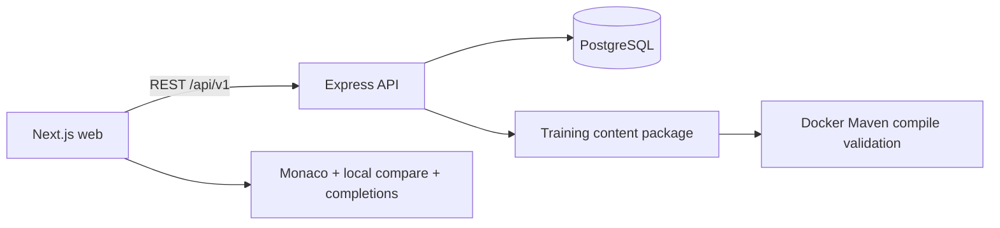

# CodeMuscle — Implementation Reference

This document describes **what is implemented** in the CodeMuscle codebase as of the current release. CodeMuscle is a desktop-first manual coding practice platform for experienced engineers who want to rebuild syntax fluency after heavy reliance on AI coding tools.

It is **not** a LeetCode, quiz, or tutorial product. The core loop is deliberate transcription of realistic Spring Boot reference code into an IDE-style editor, with real-time comparison, deterministic autocomplete, and long-term metrics.

---

## 1. Product purpose

| Goal | Implementation |
|---|---|
| Preserve manual coding fluency | Dual-pane practice: type in center, reference on right |
| Measure improvement over time | Session attempts, daily metrics, streak, topic stats |
| Avoid AI dependency during practice | No LLM integrations; paste blocked by default |
| Allow IDE-like assistance | Deterministic Monaco Java completion provider |
| Motivate consistent practice | Daily goals, achievements, recommendations |

---

## 2. Technology stack

| Layer | Technology |
|---|---|
| Monorepo | pnpm workspaces |
| Frontend | Next.js 15 (App Router), React 19, TypeScript (strict), TanStack Query, Zod, Monaco Editor, Lucide icons, Recharts |
| Backend | Node.js, Express, TypeScript (strict), Prisma ORM, PostgreSQL, Zod, Pino, Helmet, CORS, rate limiting |
| Content | On-disk Java 21 / Spring Boot 3.3 projects + JSON manifests |
| Tooling | Vitest, React Testing Library, Playwright, Docker Compose, GitHub Actions |
| Styling | Custom IDE-inspired CSS (`globals.css`), dark/light/system themes |

Ports (local default):

- Web: `http://localhost:3000`
- API: `http://localhost:4000` (`/api/v1`)
- PostgreSQL: `5432`

---

## 3. Repository structure

```text
codemuscle/
  apps/
    web/                     Next.js UI + Monaco practice workspace
    api/                     Express API, Prisma, services, OpenAPI JSON
  packages/
    shared/                  Zod contracts, shared types, language interfaces
    training-content/        Four Java projects + loader + Maven validator
    typescript-config/       Shared strict TypeScript baseline
  infrastructure/            API and web Dockerfiles
  e2e/                       Playwright smoke tests
  docker-compose.yml
  pnpm-workspace.yaml
  package.json
  README.md
  implementation.md
  .github/workflows/ci.yml
```

---

## 4. Architecture



### Design decisions

1. **Local profile first** — one seeded user (`local-user`); schema is ready for future authentication.
2. **Browser-side comparison** — keystroke feedback stays local for latency; finish metrics are recalculated on the server.
3. **No AI services** — code never leaves the local stack for generation or review.
4. **Language-neutral contracts** — `LanguageDefinition` exists in shared types; only Java content is implemented.
5. **Versioned training content** — Java sources live on disk under manifests; seed upserts by stable IDs and content hashes.

---

## 5. Frontend pages

| Route | Feature |
|---|---|
| `/onboarding` | First-visit setup and start of first practice file |
| `/` | Today dashboard: goal, streak, KPIs, queue, achievements, projects |
| `/projects` | Project catalog with completion progress |
| `/projects/[projectId]` | Ordered file list, topics, best attempt signals, practice links |
| `/practice/[projectId]/[fileId]` | Three-pane practice workspace |
| `/statistics` | KPI totals, timeseries chart, consistency, topic performance |
| `/sessions` | Recent session history |
| `/settings` | Theme, editor, comparison, paste, daily goal |

Navigation (always visible): **Today · Projects · Statistics · Sessions · Settings**.

---

## 6. Onboarding

Implemented at `/onboarding`. On first visit (when `onboardingComplete` is false), the dashboard redirects here.

### Configurable fields

- Daily goal: **15 / 30 / 45 / 60** minutes
- Theme: **dark / light / system**
- Editor font size
- Tab size
- Synchronized scrolling (on/off)
- Allow paste for accessibility (off by default)
- Language: **Java** active; **Python — Coming soon** (disabled)
- Initial practice project (all four Java projects)

### Behaviour

1. Saves settings with `onboardingComplete: true`
2. Loads the selected project
3. Navigates to the first practice file (`/practice/{projectId}/{fileId}`)
4. Creates a local profile automatically — **no email registration**

---

## 7. Dashboard (`/`)

| Section | What it shows |
|---|---|
| Daily goal | Today’s active minutes vs target |
| Current streak | Consecutive practice days (UTC) |
| Correct CPM | Average correct characters per minute |
| Manual coding ratio | Share of manually typed vs completion-inserted characters |
| Recommended practice queue | Top ranked files with reasons |
| Recent achievements | Latest unlocked achievements |
| Project progress cards | Completion counts per project |
| Python card | Visible “Coming soon” state |

---

## 8. Practice workspace

Primary screen: `/practice/[projectId]/[fileId]`.

### 8.1 Left explorer

| Feature | Status |
|---|---|
| Language selector | Java active; Python disabled “Coming soon” |
| Project selector | Instant switch between the four projects |
| Search files | Filters the tree |
| Expand all / Collapse all | Folder controls |
| Repository-style folder tree | Built from training file paths |
| Folder expand/collapse | Per folder |
| Current file indicator | Highlighted selection |
| File completion status | Checkmark when completed |
| File accuracy indicator | Progress/accuracy bar when attempts exist |
| Resizable width | Drag handle (~180–480px) |
| Hide / show explorer | Toggle rail |

Progress is persisted per file/project in the database, so switching projects does not lose prior work.

### 8.2 Center typing editor (Monaco)

| Feature | Status |
|---|---|
| Java syntax highlighting | Yes |
| Line numbers | Yes |
| Bracket pair colorization | Yes |
| Configurable tab size | Yes |
| Configurable font size | Yes |
| Minimap toggle | Yes (settings) |
| Word wrap toggle | Yes (settings) |
| Undo / redo | Monaco built-in |
| Find | Monaco built-in |
| Multi-cursor | Monaco (`ctrlCmd` modifier) |
| Dark / light editor themes | Follows app theme |
| IntelliJ-style completions | Deterministic provider (see §10) |
| Ctrl+Space / keyboard accept | Monaco suggest widget |
| Paste blocked by default | Yes — toast message shown |
| Accessibility paste override | Settings: “Allow paste” |
| Paste attempt tracking | Counted when blocked |
| Manual vs autocomplete character tracking | Yes (heuristic for completions) |
| Reset / clear file | Yes |
| Pause / resume session | Yes |
| Restart session | Yes (abandons old, starts new) |
| Finish file | Yes → summary dialog |

Paste toast copy:

> Manual practice mode is active. Pasting is disabled for this session.

### 8.3 Right reference editor

| Feature | Status |
|---|---|
| Read-only Monaco | Yes |
| Same font/tab/wrap settings | Yes |
| Hide reference temporarily | Yes |
| Reveal complete file | Yes |
| Reveal current block | Yes (approximate method/block window) |
| Synchronized scrolling | Yes when enabled |
| File metadata | Difficulty, topics, estimated minutes |
| Copy disabled by default | Read-only + no context menu |

### 8.4 Practice header

Compact metrics bar with stable layout:

- Project name and file path
- Difficulty tag
- Session timer
- Token accuracy
- Correct CPM estimate
- File progress percentage
- Pause / Reset / Finish actions

### 8.5 Session completion dialog

Shown after Finish:

- Correct CPM, Raw CPM, Lines/min
- Token accuracy, Manual ratio, Autocomplete dependency
- Errors, Paste attempts
- Professional insight text
- Actions: **Repeat file**, **Mark for repetition**, **Next recommended**, **Statistics**, **Close / Dashboard**

---

## 9. Real-time comparison engine

Implemented in:

- Browser: `apps/web/lib/comparison.ts`
- API: `apps/api/src/services/comparison.ts`

### Modes

| Mode | Behaviour | Default |
|---|---|---|
| **Syntax** | Tokenize Java; ignore whitespace/formatting; strip comments for compare | Yes |
| **Strict** | Exact character match including formatting and comments | No |

### Feedback states

- Correct
- Current mismatch
- Completed file (tokens fully match)

### Metrics formulas

| Metric | Formula |
|---|---|
| Correct CPM | correct characters ÷ active minutes |
| Raw CPM | (manual + autocomplete characters) ÷ active minutes |
| Lines per minute | completed reference lines ÷ active minutes |
| Token accuracy | matching tokens ÷ compared tokens × 100 |
| Character accuracy | matching characters ÷ typed characters × 100 |
| Manual coding ratio | manual characters ÷ total inserted × 100 |
| Autocomplete dependency | autocomplete characters ÷ total inserted × 100 |
| Average recovery time | mean of recorded recovery intervals (ms) |

Immediate comparison runs in the browser. Finish recalculates on the API and persists a `FileAttempt`.

---

## 10. Deterministic Java code completion

Provider: `apps/web/lib/completions.ts`  
Registered via `monaco.languages.registerCompletionItemProvider("java", ...)`.

**No LLM calls.** Suggestions are deterministic.

### Supported completion sources

1. Contextual `System.` members (`out`, `err`, `currentTimeMillis()`, …)
2. Contextual `System.out.` members (`println()`, `print()`, `printf()`, …)
3. Map methods after a Map-like identifier (`.put()`, `.computeIfAbsent()`, …)
4. Set methods after a Set-like identifier
5. Stream methods after `.stream()`
6. Spring Boot and Lombok annotations on `@`
7. Generic snippets: `List<T>`, `Set<T>`, `Map<K, V>`, `Optional<T>`, `ResponseEntity<T>`
8. PascalCase symbols extracted from the current reference file

### Interaction

- Prefix filtering via Monaco word range
- Keyboard navigation
- Enter / Tab accept
- Escape dismiss
- Trigger characters: `.` and `@`
- Accepted completion characters tracked separately from manual typing

Completions are limited to one statement / expression — they do not paste whole reference files.

---

## 11. Session system

### Lifecycle

| Action | Behaviour |
|---|---|
| Start | Created on first typing (`POST /sessions`) |
| Pause | Stops timer; increments active duration on server |
| Resume | Returns to ACTIVE; updates `lastResumedAt` |
| Finish | Persists attempt, daily metrics, goal progress, achievements |
| Restart | Marks previous session ABANDONED; creates a new session |
| Reset file | Clears editor and local counters |
| Autosave | Draft saved ~1.8s after typing stops |
| Refresh restore | ACTIVE/PAUSED session + draft restored |

### Tracked fields (attempt)

- Typed code
- Completion percentage
- Character / token accuracy
- Correct / raw CPM, lines per minute
- Manual and autocomplete character counts
- Autocomplete dependency ratio
- Keystrokes, backspaces, paste attempts
- Error / corrected error counts (API fields ready)
- Average recovery time
- Completed flag

---

## 12. Statistics and KPIs

Page: `/statistics`

| Feature | Status |
|---|---|
| Lifetime active minutes | Yes |
| Files completed | Yes |
| Average accuracy / CPM | Yes |
| Manual coding ratio | Yes |
| Current streak | Yes |
| 30-day Correct CPM chart | Yes (Recharts, lazy-loaded) |
| Consistency score | Yes (coefficient of variation over recent attempts) |
| Topic performance | Yes (average accuracy / CPM per topic) |
| Formula explanations | Yes |

Dashboard timeseries backed by `DailyMetric` rows written on session finish.

---

## 13. Motivation and achievements

### Motivation signals

- Daily practice streak
- Daily goal progress
- Project completion percentage
- Reduced autocomplete dependency (achievement)
- Accuracy and speed milestones

### Seeded achievements

| ID | Name | Unlock condition |
|---|---|---|
| `first-file` | First complete file | Complete any file |
| `first-project` | First complete project | Complete every file in a project |
| `seven-day-streak` | Seven-day streak | Streak ≥ 7 |
| `accuracy-ten-files` | Precision streak | 10 completed files at ≥98% token accuracy |
| `ten-files` | Ten files completed | 10 completed attempts |
| `one-hour` | One hour of practice | ≥ 60 minutes total active time |
| `ten-hours` | Ten hours of practice | ≥ 600 minutes total active time |
| `low-autocomplete` | Autocomplete independence | Finish with dependency &lt; 20% |
| `speed-best` | New speed best | Beat previous best Correct CPM |
| `perfect-syntax` | Perfect syntax | 100% token accuracy |

Achievements are persisted as `UserAchievement` rows and shown on the dashboard.

---

## 14. Recommended practice queue

API: `GET /api/v1/recommendations/daily`  
Algorithm: `apps/api/src/services/recommendations.ts`

### Ranking signals (highest first)

1. Marked for repetition
2. Accuracy below 95%
3. Not yet completed
4. Not practised in the last seven days
5. Weak topic relative to personal topic average
6. Project file order (soft tie-breaker)

Returns top 5 items with a human-readable **reason** string for the dashboard and completion dialog “Next recommended” action.

Mark / unmark repetition:

- `POST /api/v1/files/:fileId/repeat`
- `DELETE /api/v1/files/:fileId/repeat`

---

## 15. Projects and languages

### Language selector

| Language | State |
|---|---|
| Java | Active — full content |
| Python | Disabled — **Coming soon** |

Shared type `LanguageDefinition` supports future languages (extensions, Monaco id, completion catalog, comparison strategy).

### Java practice projects (112 files)

| Project | Slug | Package | Files | Focus |
|---|---|---|---|---|
| Employee HR Management System | `employee-hr-system` | `com.codemuscle.hr` | 29 | Employees, departments, leave, salary validation, streams, JWT security |
| Logistics and Shipment Management System | `logistics-system` | `com.codemuscle.logistics` | 27 | Shipments, warehouses, tracking, cost strategies, JWT security |
| Energy Consumption and Billing System | `energy-billing-system` | `com.codemuscle.energy` | 28 | Meter readings, tariffs, BigDecimal billing, JWT security |
| Multi-Tenant B2B SaaS Platform | `b2b-saas-platform` | `com.codemuscle.saas` | 28 | Tenants, roles, permissions, usage limits, JWT security |

Each project includes:

- `manifest.json` (metadata, order, topics, difficulty)
- Compilable `project/` tree (`pom.xml`, `application.yml`, sources, ≥1 unit test)
- Spring-style layers: application, model/enums, DTO, repository, mapper, service + impl, controller, exception handling, config, util/strategy

### Content topics tagged in manifests

Examples: `spring-boot`, `collections`, `streams`, `big-decimal`, `date-time`, `exception-handling`, `spring-controller`, `service-layer`, `strategy-pattern`, `multi-tenancy`, `concurrency`, `validation`, `mapping`, `lombok`.

---

## 16. Database model (Prisma)

Enums:

- `SessionStatus`: `ACTIVE`, `PAUSED`, `COMPLETED`, `ABANDONED`
- `ComparisonMode`: `SYNTAX`, `STRICT`

Models:

| Model | Purpose |
|---|---|
| `UserProfile` | Local developer profile |
| `UserSettings` | Theme, editor, paste, comparison, daily goal, onboarding flag |
| `Language` | Java / Python registry |
| `TrainingProject` | Practice project metadata |
| `TrainingFile` | Reference code + difficulty/order/hash |
| `Topic` / `TrainingFileTopic` | Topic tags |
| `PracticeSession` | Session lifecycle |
| `FileAttempt` | Finished attempt metrics |
| `DailyMetric` | Aggregated daily KPIs |
| `Achievement` / `UserAchievement` | Motivation unlocks |
| `PracticeGoal` | Daily goal completion |
| `SavedDraft` | Autosaved typed code |
| `Repetition` | Files marked for later practice |

Indexes cover user+date, project+file, session start time, and file order.

Seed loader:

1. Upserts languages and local user
2. Upserts achievements
3. Reads training manifests + `.java` files
4. Upserts projects/files/topics while preserving progress on content updates

---

## 17. REST API (`/api/v1`)

### System

| Method | Path | Purpose |
|---|---|---|
| GET | `/health` | Liveness |
| GET | `/ready` | Database readiness |
| GET | `/openapi.json` | OpenAPI 3.1 document |

### Profile and settings

| Method | Path | Purpose |
|---|---|---|
| GET/PATCH | `/profile` | Local profile |
| GET/PATCH | `/settings` | User settings |

### Catalog

| Method | Path | Purpose |
|---|---|---|
| GET | `/languages` | Language list |
| GET | `/projects` | Projects + progress |
| GET | `/projects/:projectId` | Project detail + files |
| GET | `/projects/:projectId/files` | File list |
| GET | `/projects/:projectId/tree` | Explorer tree |
| GET | `/files/:fileId` | File + draft/attempts |

### Sessions

| Method | Path | Purpose |
|---|---|---|
| POST | `/sessions` | Start |
| GET/PATCH | `/sessions/:sessionId` | Read / update |
| POST | `/sessions/:sessionId/pause` | Pause |
| POST | `/sessions/:sessionId/resume` | Resume |
| POST | `/sessions/:sessionId/restart` | Restart |
| POST | `/sessions/:sessionId/finish` | Finish + persist |
| PUT/GET | `/sessions/:sessionId/draft` | Autosave draft |
| POST | `/sessions/:sessionId/metrics` | Calculate metrics without finishing |

### Dashboard and motivation

| Method | Path | Purpose |
|---|---|---|
| GET | `/dashboard/summary` | KPI summary + streak |
| GET | `/dashboard/timeseries` | Daily metrics |
| GET | `/dashboard/topics` | Topic performance |
| GET | `/dashboard/recent-sessions` | Last 20 sessions |
| GET | `/dashboard/personal-bests` | Max CPM / accuracy / LPM |
| GET | `/dashboard/projects` | Redirects to `/projects` |
| GET | `/recommendations/daily` | Practice queue |
| POST/DELETE | `/files/:fileId/repeat` | Repetition flag |
| GET | `/achievements` | All definitions |
| GET | `/achievements/unlocked` | User unlocks |

### Cross-cutting API behaviour

- Zod validation on bodies/params
- Consistent error envelope: `{ error: { code, message, details } }`
- Helmet, CORS allowlist, rate limiting, JSON size limit
- Structured logging (Pino)
- Prisma prevents SQL injection
- Single local user id for this release

---

## 18. Settings page features

| Setting | Effect |
|---|---|
| Theme | App CSS + Monaco `vs` / `vs-dark` |
| Font size | Both editors |
| Tab size | Both editors |
| Word wrap | Both editors |
| Minimap | Typing editor |
| Synchronized scrolling | Links typing ↔ reference scroll |
| Paste permission | Accessibility override |
| Comparison mode | Syntax vs strict |
| Daily goal | Dashboard target |

Progress reset is intentionally unavailable in this release (documented in the UI).

---

## 19. Training content system

Location: `packages/training-content/`

```text
java/
  employee-hr-system/
    manifest.json
    project/                 Full Spring Boot project
  logistics-system/
  energy-billing-system/
  b2b-saas-platform/
scripts/generate-projects.mjs
src/index.ts                 Manifest + file loader
src/validate.ts              Docker Maven compile
```

### Loader responsibilities

1. Read each `manifest.json`
2. Load `.java` reference sources from `project/`
3. Compute SHA-256 `contentHash`
4. Export `trainingProjects` for API seed and validation
5. Preserve stable file IDs for progress continuity

### Validation

```bash
pnpm validate:training-projects
```

Compiles every project with `maven:3.9.11-eclipse-temurin-21` via Docker.

---

## 20. Security and privacy (local first release)

| Control | Status |
|---|---|
| Helmet | Yes |
| CORS allowlist | Yes (`WEB_ORIGIN`) |
| Rate limiting | Yes |
| Payload size limit | Yes (512kb JSON) |
| Zod input validation | Yes |
| Safe API error messages | Yes (no DB stack traces to clients) |
| `.env` gitignored + `.env.example` | Yes |
| Prisma parameterized queries | Yes |
| No external telemetry | Yes |
| No AI API integration | Yes |
| No third-party code upload | Yes |

---

## 21. Testing

### Unit / component (Vitest)

| Area | Coverage |
|---|---|
| API comparison + metrics | Token/strict modes, ratios, recovery average |
| Recommendations | Repetition and accuracy priority |
| Project tree builder | Nested path nodes |
| Streak calculation | Consecutive UTC days |
| Web comparison | Syntax ignore-whitespace parity |
| Paste helpers | Block vs allow |
| Reference block reveal | Block slicing |
| Theme resolution | Dark/light/system |
| Explorer | Expand/collapse, file select, project switch |
| Training catalog | 4 projects, ≥15 files each, unique packages |

### End-to-end (Playwright)

| Scenario | Status |
|---|---|
| Complete onboarding | Yes |
| Land in HR Java practice | Yes |
| See Python coming soon option | Yes |
| Type into editor and see live metrics UI | Yes |
| Project catalog lists all four projects | Yes |

### Java content

All four reference projects compile under Maven in CI / `validate:training-projects`.

---

## 22. Developer commands

```bash
pnpm install
pnpm dev                      # API + web together
pnpm build
pnpm lint                     # TypeScript checks across packages
pnpm typecheck
pnpm test
pnpm test:e2e
pnpm validate:training-projects
pnpm db:migrate
pnpm db:seed
pnpm db:reset
docker compose up -d
docker compose down
```

PhpStorm helpers: `phpstorm:install`, `phpstorm:setup`, `phpstorm:run`.

---

## 23. Docker and CI

### Docker Compose services

- `postgres` (health-checked)
- `api`
- `web`

### CI pipeline (GitHub Actions)

1. Install dependencies  
2. Generate training content  
3. Prisma generate + migrate + seed  
4. Typecheck  
5. Unit tests  
6. Production build  
7. Validate Java projects (Maven in Docker)

---

## 24. Shared contracts (`@codemuscle/shared`)

Implemented shared artifacts include:

- Settings / profile / session / draft / metrics Zod schemas
- `TrainingFile` / `TrainingProject` / `TreeNode` types
- `ComparisonResult` / `CalculatedMetrics`
- `LanguageDefinition` / `CompletionDefinition` interfaces
- `JAVA_KEYWORDS` constant
- Theme, comparison mode, and difficulty enums

Web and API both consume these contracts to avoid duplicated types.

---

## 25. Feature checklist (implemented)

### Product experience

- [x] Onboarding without registration  
- [x] Local profile + settings persistence  
- [x] Dashboard with goal, streak, queue, achievements  
- [x] Project catalog and project detail  
- [x] Three-pane practice workspace  
- [x] Explorer with search, expand/collapse, resize, hide  
- [x] Java active / Python coming soon  
- [x] Four complete Java Spring Boot projects (112 practice files)  
- [x] Paste blocked by default + accessibility override  
- [x] Deterministic completions (System/collections/annotations/generics/reference symbols)  
- [x] Syntax and strict comparison modes  
- [x] Session pause / resume / restart / finish  
- [x] Draft autosave and refresh restore  
- [x] Completion summary dialog  
- [x] Statistics page with chart and topics  
- [x] Session history list  
- [x] Recommendations algorithm  
- [x] Achievements unlock + persistence  
- [x] Theme (dark/light/system) + Monaco theme sync  
- [x] Synchronized scrolling  
- [x] Reference complete / block reveal modes  

### Platform

- [x] Express REST API under `/api/v1`  
- [x] Prisma schema, migration, seed  
- [x] Daily metrics aggregation  
- [x] OpenAPI JSON document  
- [x] Health and readiness endpoints  
- [x] Docker Compose + Dockerfiles  
- [x] GitHub Actions CI  
- [x] Unit tests + Playwright smoke + Maven validation  
- [x] README + this implementation document  

---

## 26. Known thin areas / deferred items

These exist partially, are schema-ready, or were intentionally deferred for the local-first release:

| Area | Notes |
|---|---|
| Authentication | Single local user; schema ready for future auth |
| Progress reset | Explicitly unavailable in Settings UI |
| Session history filters | List only (no date/accuracy filters yet) |
| Structural comparison layer | Imports/class/methods progress not separately tracked |
| Live error-line highlighting | Status text shown; no red-gutter diagnostics |
| Recovery timing population | API accepts values; client currently sends empty arrays |
| Full JDK / keyword completion catalog | Contextual subset implemented |
| Project-wide symbol index | Reference-file symbols only today |
| Multi-chart statistics | Correct CPM chart + topic list; not every chart from the original brief |
| Tailwind / ESLint shared package | Custom CSS; lint via TypeScript |
| Swagger UI | OpenAPI JSON served; interactive UI not mounted |
| Deep e2e coverage | Smoke tests only (not full pause/finish/persist journey) |
| Python content | Selector only — no training files |

---

## 27. How to verify the implementation locally

```bash
pnpm install
docker compose up -d postgres
copy .env.example .env
pnpm --filter @codemuscle/api exec prisma generate
pnpm db:migrate
pnpm db:seed
pnpm dev
```

Then open `http://localhost:3000`, complete onboarding, open an HR file, type against the reference, and finish a session to see metrics, recommendations, and achievements update.

---

## 28. Recent workflow and IDE-behaviour updates

### Project entry choices

Project cards now expose two explicit workflows:

- **Choose files** opens the project detail page and its complete ordered file list.
- **Full practice** opens the next unfinished file, falling back to the first file when the project is complete.

The project API calculates `nextFileId` from persisted completed sessions rather than using a hard-coded file.

### Java package starter

A new Java exercise no longer opens as a completely blank document. The typing editor extracts the real package declaration from the selected reference file and starts with:

```java
package com.codemuscle.example;

```

The generated package text is not counted as manually typed or autocomplete-inserted input. Clear, reset, and restart restore the correct package starter.

### Automatic Java imports

Accepted Monaco completions can apply `additionalTextEdits` to the import section, similar to IntelliJ IDEA. Automatic imports cover:

- Java collections (`List`, `Set`, `Map`, `HashMap`, `HashSet`)
- `Optional` and `ConcurrentHashMap`
- Spring MVC, stereotype, configuration, validation, and transaction annotations
- `ResponseEntity`
- Lombok annotations
- Symbols whose imports are present in the current reference file

Imports are inserted beneath the package/import section. Existing imports, `java.lang` types, and types from the current package are not duplicated.

### Persistent explorer state

The repository explorer remembers expanded and collapsed folders independently for each project:

1. Every expand, collapse, Expand all, and Collapse all action is written synchronously to local storage.
2. Switching to another file preserves all unrelated open folders.
3. Parent folders of the selected file are opened without closing other folders.
4. The active file is scrolled into view and remains highlighted.
5. Refreshing the page restores the same project-specific expansion state.
6. Invalid stored state safely falls back to the standard `src/main/java` expansion.

### PhpStorm run workflow

The root `package.json` includes scripts intended for PhpStorm's npm tool window:

- `phpstorm:install`
- `phpstorm:setup`
- `phpstorm:run`
- `dev:api`
- `dev:web`
- `db:start`
- `db:stop`

These scripts bootstrap the pinned pnpm version through `npx`, so a separate global pnpm installation is not required.

---

## 29. CRUD, MapStruct, and IntelliJ-style presentation

### Complete controller operator coverage

Every primary project controller now contains realistic endpoints using all standard CRUD HTTP operators:

- `@GetMapping`
- `@PostMapping`
- `@PutMapping`
- `@PatchMapping`
- `@DeleteMapping`

Employee and tenant controllers expose entity create, read/list, replacement, status patch, and deletion. Logistics uses creation, tracking/queue reads, status replacement/patching, and cancellation. Energy provides reading ingestion, replacement/patching, queries, invoice generation, and meter-reading deletion. Corresponding service and repository operations are included where persistence changes are required.

### MapStruct in every Java project

All generated Maven projects now include MapStruct 1.6.3 and its annotation processor. The compiler configuration includes:

- `mapstruct`
- `mapstruct-processor`
- Lombok
- `lombok-mapstruct-binding`

Project mapper exercises:

| Project | MapStruct mapper |
|---|---|
| Employee HR | `EmployeeMapper` |
| Logistics | `ShipmentMapper` |
| Energy billing | `BillingMapper` |
| Multi-tenant SaaS | `TenantMapper` |

All four projects compile with Java 21 after annotation processing.

### Readable completion popup

The Monaco suggestion widget has a minimum width of 430px and a minimum one-row height. A single filtered suggestion therefore remains visible with its label and detail instead of collapsing into a tiny box.

### Java role icons in the explorer

Java files use compact IDE-style colored type markers derived from their repository role:

- Controller
- Repository
- MapStruct mapper
- Service interface
- Service implementation
- DTO / record
- Domain model
- Enum
- Configuration
- Exception
- Spring Boot application
- General Java class

These are original text-based markers inspired by professional IDE conventions rather than copied proprietary assets.

### Java editor palette

Both Monaco panes use CodeMuscle Java dark/light themes with an IntelliJ-inspired semantic palette:

- Warm keywords
- Olive annotations
- Green strings
- Blue numeric literals
- Gray italic comments
- Distinct line highlight, selection, caret, indent guides, line numbers, and suggestion widget states

The palette is applied equally to the typing and read-only reference editors and follows the selected light, dark, or system theme.

### Complete Java keyword completion

The deterministic Monaco provider includes the complete Java keyword catalog and the `true`, `false`, and `null` literals. Declaration keywords such as `public`, `protected`, `private`, `class`, `interface`, `record`, and `enum` are included alongside control-flow, exception, inheritance, modifier, primitive-type, and concurrency keywords.

Keyword results use Monaco's keyword icon and insert only the selected keyword. Prefix filtering means inputs such as `pub`, `inter`, `synch`, and `throw` immediately narrow the completion list without inserting a large code block.

### Annotation completion reliability

Typing bare `@` or a prefix such as `@Rest`, `@Get`, `@Data`, or `@Map` opens annotation completions. The completion edit replaces the complete `@prefix` range, while its automatic import edit is anchored to the package declaration so the edits never overlap. This supports Spring Boot, Spring MVC, Spring stereotypes/configuration, validation, transactions, Lombok, JPA, MapStruct, and custom annotations discovered in the reference file.

---

## 30. JWT authentication in every Java project

All four Spring Boot reference projects implement the same stateless JWT security boundary.

Each project includes Spring Security, OAuth2 resource-server/Jose support, BCrypt password hashing, and a `SecurityConfiguration`. Registration and login are public; every other endpoint requires a valid bearer token. Missing, expired, or invalid tokens are rejected by the security filter chain before business-controller invocation.

`PlatformUser` stores a stable ID, username, BCrypt password hash, email, display name, job title, locale, roles, enabled state, and creation timestamp. Plaintext passwords exist only in validated registration/login request DTOs and are never persisted or returned.

Authentication endpoints:

```http
POST /api/auth/register
POST /api/auth/login
GET  /api/auth/me
```

Registration creates the user and returns a signed token. Login verifies the password hash and issues a one-hour HMAC-SHA256 JWT. `/me` demonstrates controller access to the validated `Jwt` principal through `@AuthenticationPrincipal`, returning its username, user ID, display name, and roles.

The signing key comes from `JWT_SECRET`; the checked-in default is intended only for local training. Controllers rely on Spring Security's validated principal rather than performing unsafe manual token parsing.
